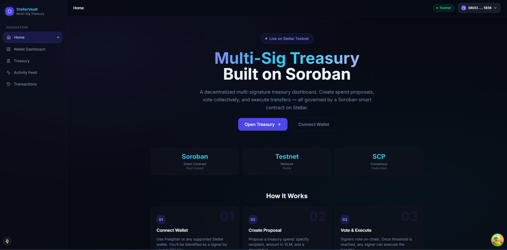
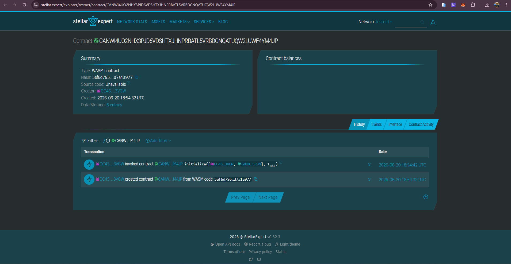

# 🏦 Multi-Signature Treasury Dashboard

A state-of-the-art, responsive operator console and Next.js frontend integrated with a **Soroban Smart Contract** on the **Stellar Testnet**. This platform enables multi-signature co-signers to collectively control and govern a shared treasury—proposing spend transfers, voting on active proposals, executing approved spends on-chain, and tracking ledger activities in real time.

---

## 📸 Screenshots

<p align="center">
  
  
</p>

*Place your manually captured screenshots as `dashboard.png` and `stellar-expert.png` inside the `/photos` folder.*

---

## 🔗 Contract Explorer & Credentials

| Resource | Value / Link |
| :--- | :--- |
| **Contract ID** | `CANWI4UO2NHX3PJD6VDSHTXJHNPRBATL5VRBDCNQATUQW2LUWF4YM4JP` |
| **Stellar Expert Explorer** | [View Contract on Stellar Expert](https://stellar.expert/explorer/testnet/contract/CANWI4UO2NHX3PJD6VDSHTXJHNPRBATL5VRBDCNQATUQW2LUWF4YM4JP) |
| **Freighter Wallet Address** | `GBUX3IHQTAIRN3BXVBWZMKFW2CF6FE4QKQWYEDHYGQXL6OQ3YFMN5R3N` |

---

## ✨ Features

- **🛡️ Multi-Signature Governance**: Establish joint administrative control with a customizable threshold (e.g. 1-of-N, 2-of-3).
- **💸 Spend Proposals**: Any registered signer can propose a spend action, identifying the target recipient address, amount in XLM, and description.
- **🗳️ Signer Voting**: Real-time cast of votes (approve/reject) with interactive progress bars demonstrating threshold compliance.
- **⚡ On-Chain Execution**: Once a proposal satisfies the approval threshold, a signer can execute the proposal to release the Stellar assets.
- **🔔 Live Event Polling**: Autonomous 5-second polling of Soroban RPC `getEvents` keeps the activity feed populated with real-time on-chain actions.
- **💼 Wallet Integration**: Full multi-wallet select modal integration using `StellarWalletsKit` with focus on Freighter wallet.

---

## ⚙️ Tech Stack & Architecture

- **Frontend Framework**: Next.js 15 (App Router)
- **Styling & Theme**: Tailwind CSS v3 (custom dark glassmorphism styling)
- **State Management**: Zustand (stores for wallet, events, and transactions)
- **Data Fetching**: TanStack Query (React Query v5)
- **Blockchain Connectivity**: `@stellar/stellar-sdk` & `@creit.tech/stellar-wallets-kit`
- **Smart Contract Target**: Soroban Rust SDK targeting WebAssembly (`wasm32v1-none`)

---

## 📂 Project Structure

```text
.
├── app/
│   ├── layout.tsx         # Root Layout, provider config, metadata
│   ├── page.tsx           # Landing landing page with feature cards
│   ├── dashboard/         # Wallet details & connection console
│   ├── treasury/          # Active proposals & spend creation console
│   ├── activity/          # Event feed panel
│   └── transactions/      # Transaction history logs
├── components/
│   ├── layout/            # Navbar & Sidebar shell UI
│   ├── wallet/            # Connection state buttons & modal wrappers
│   ├── treasury/          # Proposal rendering & vote status cards
│   └── activity/          # Live event feeds
├── contracts/
│   └── treasury/          # Rust Smart Contract containing multi-sig logic
├── hooks/                 # Custom React queries & mutation logic hooks
├── lib/
│   ├── stellar/           # Clients, wallet kits, contract connectors
│   └── utils.ts           # Styling class merge utilities
└── store/                 # Global Zustand state containers
```

---

## 🚀 Setup & Local Execution

### Prerequisites
- Node.js (v18+)
- Freighter browser extension configured for Testnet

### 1. Install Dependencies
```bash
npm install
```

### 2. Configure Environment Variables
Verify or create a `.env.local` file at the root containing the active deployment:
```env
NEXT_PUBLIC_STELLAR_NETWORK=testnet
NEXT_PUBLIC_STELLAR_RPC_URL=https://soroban-testnet.stellar.org
NEXT_PUBLIC_NETWORK_PASSPHRASE="Test SDF Network ; September 2015"
NEXT_PUBLIC_TREASURY_CONTRACT_ID=CANWI4UO2NHX3PJD6VDSHTXJHNPRBATL5VRBDCNQATUQW2LUWF4YM4JP
NEXT_PUBLIC_HORIZON_URL=https://horizon-testnet.stellar.org
NEXT_PUBLIC_NATIVE_TOKEN_ADDRESS=CDLZFC3SYJYDZT7K67VZ75HPJVIEUVNIXF47ZG2FB2RMQQVU2HHGCYSC
```

### 3. Run Development Server
```bash
npm run dev
```
Open [http://localhost:3000](http://localhost:3000) to view the application dashboard.

### 4. Build for Production
```bash
npm run build
npm run start
```

---

## 🔄 Core User Flow

1. **Connect Wallet**: Authenticate Freighter wallet (primary owner: `GBUX3IHQTAIRN3BXVBWZMKFW2CF6FE4QKQWYEDHYGQXL6OQ3YFMN5R3N`).
2. **Propose Spend**: Access **Treasury** and fill out the Spend Proposal form.
3. **Vote**: Registered signers review proposals under **Active Proposals** and click Approve or Reject.
4. **Execute**: When the proposal meets the approval threshold, click the **Execute** action button to submit the transaction to the Stellar ledger.
5. **Monitor Events**: View incoming transaction receipts and live signals under the **Activity Feed**.
